# How to start programming  in Scala with Spark 

Hello Everyone, today we are going to discuss how to start programming in **Scala** with **Spark**.

## Introduction

 Scala is ranked among the top 10 [highest programming languages in 2022](https://insights.stackoverflow.com/survey/2021/#technology-top-paying-technologies), and thus is becoming essential for professionals in this field. However, Scala is also a complex language and you’ll need advanced skills as well as in-depth knowledge of programming languages and coding to learn Scala.

If you are familiar with Python, you might ask why you should learn Scala, well, both Scala and Python are high-level programming languages with a concise syntax. However, these languages have several different features.

Scala programming language is statically typed and requires you to specify the types of variables and objects. Python is a dynamically typed programming language and there is no need to specify objects.

Scala is a scalable language with access to Java libraries. Hence it is better than Python in terms of scalability and efficiency.

Scala supports better concurrency and multithreading, thus allowing big data ecosystems to be integrated easily. Python, on the other hand, does not support a high level of concurrency and is not suitable for big data systems. It is a statically typed language which means you can find and rectify the errors during compilation.  Let us begin with the installation of Spark and Scala.

## Setup of Scala and Spark

First you need  install **Scala with Spark** , you can follow this [tutorial](https://ruslanmv.com/blog/How-to-install-Spark-on-Windows) .

Once you have installed Spark, you can enter to your terminal and type

```
spark-shell
```

and you will have something like

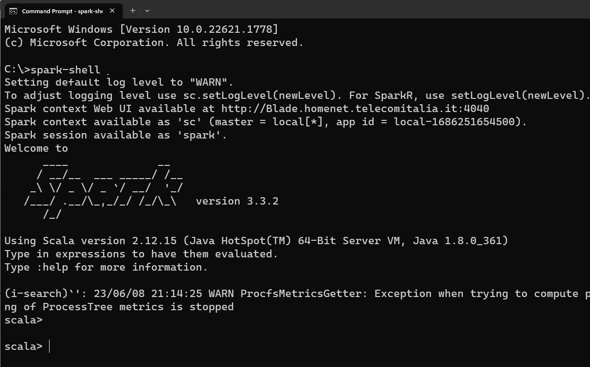

Before start programming in **Scala** by using **Spark** it is important to know the **Spark** that you are using, because depending of the **version** and **where** is installed may help to have control of the programs that  you are coding. Otherwise you will have a lot of issues during the creation of your new programs. 

The following examples that I will cover in this tutorial will be made on **spark-shell**. It allows you to create Spark programs interactively and submit work to the framework.   Once you familiarize yourself with **spark-shell** we can go an step further and create projects with  **Maven** and **SBT** that are a common build tools in the Scala ecosystem.

**Maven** is a powerful project management tool that is based on POM (project object model). It is used for projects build, dependency and documentation. and **SBT**  is another a build tool that helps one manage their Scala project, which includes building, compiling, testing, as well as managing libraries and dependencies. But  in ordering to learn **Spark**, let first start with **spark shell** and discuss how to use it.

## How to know the version of Spark?

You can get the spark version by using one the following commands:

```
spark-submit --version
```

or

```
spark-shell --version
```

or


```
spark-sql --version
```

for example

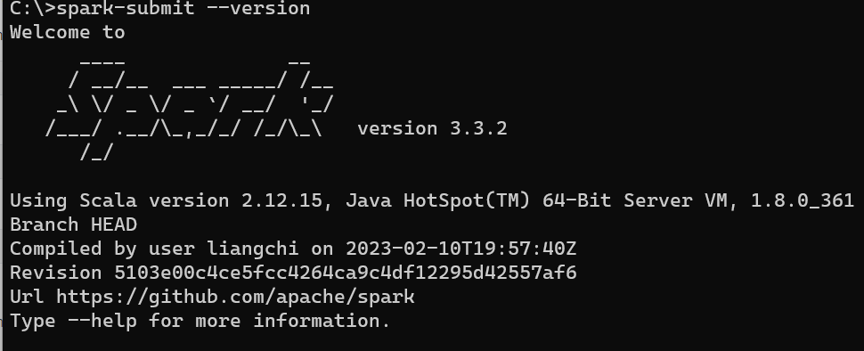

## How to use two versions of spark shell?

When you are working in a cluster sometimes it is installed different versions of spark, so for example versions 1.6 and 2.0

you can run Scala 1.6 with the following command
```
spark-shell
```
and to loads Spark 2.0

```
spark2-shell
```
If you are in a Linux System you can load spark 2.0 with the following command
```
SPARK_MAJOR_VERSION=2 spark-shell
```

If you dont have older versions , just you can type `spark-shell`.

To exit of the terminal you can type 

```
:quit
```

## What is Spark Session?

This is one of the **most difficult part of spark when you are starting**. Because is not enough know **Scala**, you need to know  more about how  **Apache Spark** works and use properly. 

**Spark session** is a unified entry point of a spark application from Spark 2.0.  It provides a way to interact with various spark’s functionality.  Instead of having a spark context, hive context, SQL context as in previous version, now all of it is encapsulated in a **spark session**

## How do I create a Spark session?

Creating spark session can be done in many ways:

1) Directly using SparkSession
2) SparkConf→ spark Context → SparkSession
3) SparkConf → SparkSession
4) SparkConf→spark context

Let practice the different methods:

### 1. Spark session Method

To create **SparkSession** in Scala or  Python by using Pyspark, you need to use the builder pattern method **builder()** and calling **getOrCreate()** method. If SparkSession already exists it returns otherwise creates a **new SparkSession**.

Let see this, first  open a terminal and type

```
spark-shell
```

then copy the following commands and paste into the terminal


```
// Create SparkSession object
import org.apache.spark.sql.SparkSession
val spark = SparkSession.builder().master("local[1]").appName("MyApp").getOrCreate()
```

if you are in windows you can get the following message

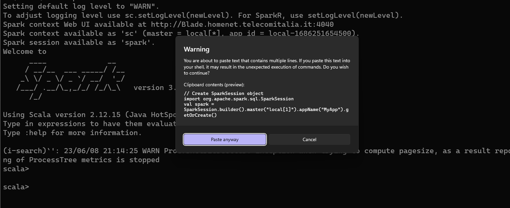

You click **Paste anyway**

and click enter

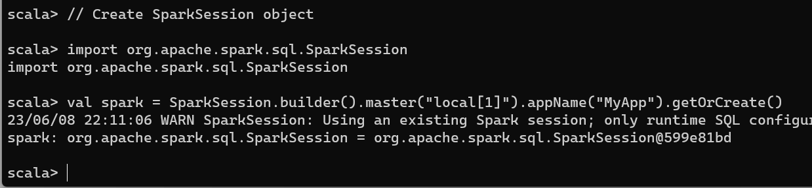

you will get the Session with the number after the @ like in this example **@599e81bd** we got `org.apache.spark.sql.SparkSession@599e81bd`

### Get Existing SparkSession

You can get the existing SparkSession in Scala programmatically using the below example

```
// Get existing SparkSession 
import org.apache.spark.sql.SparkSession
val spark = SparkSession.builder().getOrCreate()
print(spark)
```

as you see you will get 

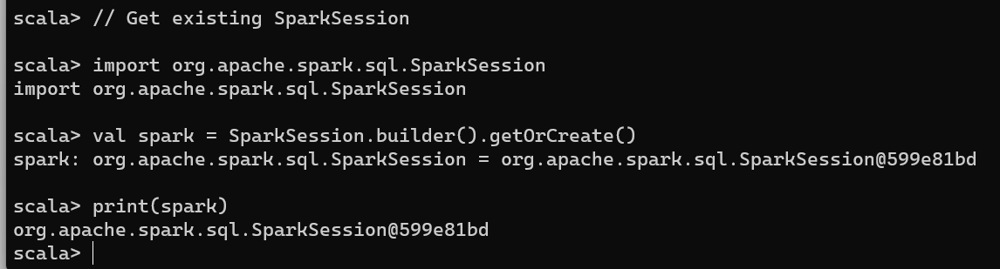

as you see we got the same session  `org.apache.spark.sql.SparkSession@599e81bd`

### 2. SparkConf→SparkSession


Setting spark conf and then passing it into sparksession)

```
import org.apache.spark.SparkConf
import org.apache.spark.sql.SparkSession
val conf = new SparkConf()
conf.set("spark.app.name","appname")
conf.set("spark.master","local[3]")
val sparkSession = SparkSession.builder().config(conf).getOrCreate()
```

you will get

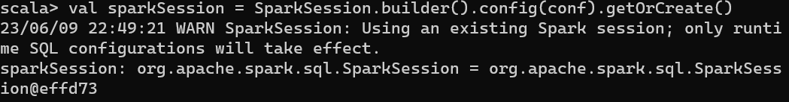

### 3. SparkConf→SparkContext→SparkSession

```
// If you already have SparkContext stored in `sc`
val spark = SparkSession.builder.config(sc.getConf).getOrCreate()
```

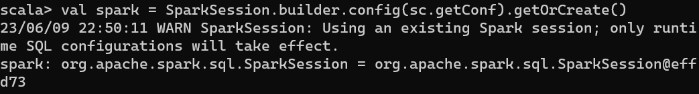


```
// Another example which builds a SparkConf, SparkContext and SparkSession
import org.apache.spark.{SparkConf, SparkContext}
val conf = new SparkConf().setAppName("sparktest").setMaster("local[2]")
val sc = new SparkContext(conf)
val spark = SparkSession.builder.config(sc.getConf).getOrCreate()
```

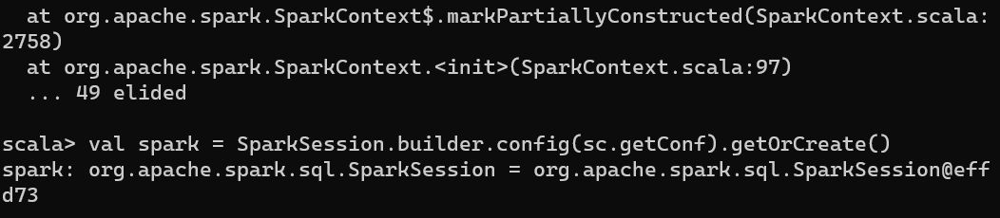

### 4. SparkConf→SparkContext

```
import org.apache.spark.{SparkConf, SparkContext}
val conf = new SparkConf().setAppName("appName").setMaster("local[*]")
val sc = new SparkContext(conf)
```


Please remember that  we can access spark context and other contexts using the spark session object

```
scala> spark.sparkContext
res2: org.apache.spark.SparkContext = org.apache.spark.SparkContext@6803b02d
```

and

```
scala> spark.sqlContext
res3: org.apache.spark.sql.SQLContext = org.apache.spark.sql.SQLContext@74037f9b
```

# Data Manipulation

Until now, we have only created the **SparkSession** and **SparkContext** . 

> **SparkContext** (JavaSparkContext for Java) is an entry point to Spark programming with **RDD** and to connect to Spark Cluster

  and

> **SparkSession** is an entry point to underlying Spark functionality to programmatically create Spark **RDD**, **DataFrame** and **DataSet**.

Once we have understood those differences is time to create **Dataframes**

## Create DataFrames

Let us first create a listt of data and then we create a dataframe by using spark, so we can copy and paste the following commands

```
// Create DataFrame
val data = List(("Scala", 25000), ("Spark", 35000), ("PHP", 21000))
val df = spark.createDataFrame(data)
df.show()
```

great, we have created our "Hello World!" dataframe by using Spark with Scala.

with this output

```
+-----+-----+
|   _1|   _2|
+-----+-----+
|Scala|25000|
|Spark|35000|
|  PHP|21000|
+-----+-----+
```

Now let us discover another tool in Spark called  **Spark SQL**.  Due to the long history of  Structured query language (**SQL**)   which is a standard language for database creation and manipulation we can implement the the technology of SQL into Spark so called  **Spark SQL** .

## Working with Spark SQL

Using **SparkSession** you can access Spark SQL capabilities in Apache Spark.  In order to use SQL features first, you need to create a temporary view in Spark.
Once you have a temporary view you can run any ANSI SQL queries using spark.sql() method.

```
// Spark SQL
df.createOrReplaceTempView("sample_table")
val df2 = spark.sql("SELECT _1,_2 FROM sample_table")
df2.show()
```

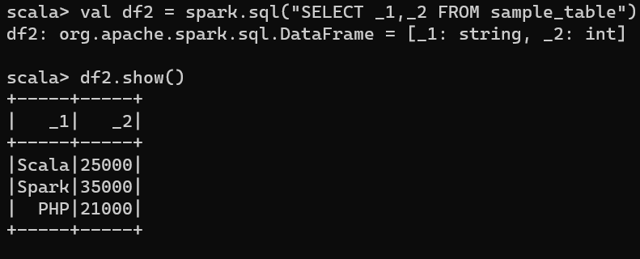

```
// Create Hive table & query it.  
spark.table("sample_table").write.saveAsTable("sample_hive_table")
val df3 = spark.sql("SELECT _1,_2 FROM sample_hive_table")
df3.show()
```

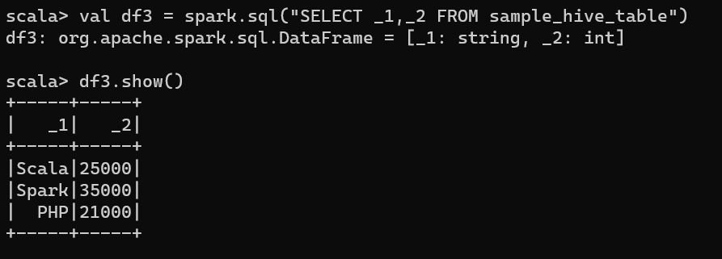


### Getting the first value from spark.sql

```
df.first
```

### Create empty DataFrame

```
val df = spark.emptyDataFrame
```
### Create empty DataFrame with schema (StructType)


## How to read a csv with Spark.

To read a csv file you can use the  structure `spark.read.csv("path")` or `spark.read.format("csv").load("path")` you can read a CSV file with fields delimited by pipe, comma, tab  into a Spark DataFrame.


Let us consider that you have an environment variable of spark ,caleed SPARK_HOME and there you have a csv that you want to read.

```
val SPARK_HOME=sys.env("SPARK_HOME")
val FILE ="\\python\\test_support\\sql\\ages.csv" \\ Windows
//val FILE ="/python/test_support/sql/ages.csv" \\ Unix
val PATH =SPARK_HOME+FILE
```

you copy and paste the previous command

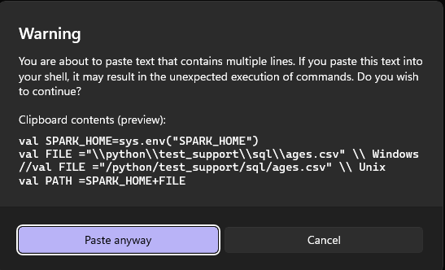

execute them and then 

```scala
val df = spark.read.csv(PATH)
```

you will get something like

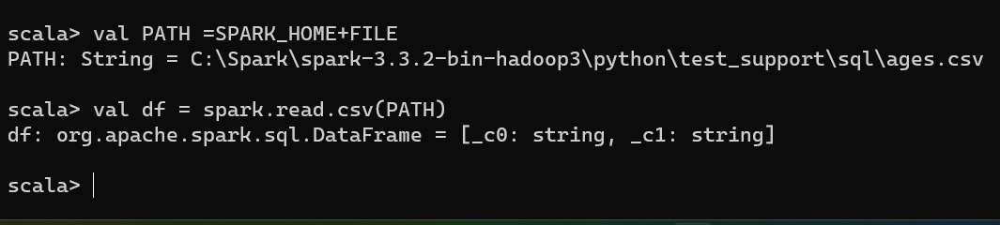

That means that you could read the file, you can verify by typing

```
df.show()
```

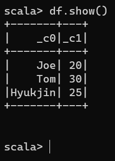


 We can specify the delimiter character by adding the method `.option( "delimiter", "," )`

```
val df = spark.read.option( "delimiter", "," ).csv(PATH)
```

As we see, this csv does not have header  and we did not  indicated which delimiter was used.

```scala
val colum_names = Seq("name","id")// this is example define exact number of columns
val dfWithHeader = df.toDF(colum_names:_*)
```


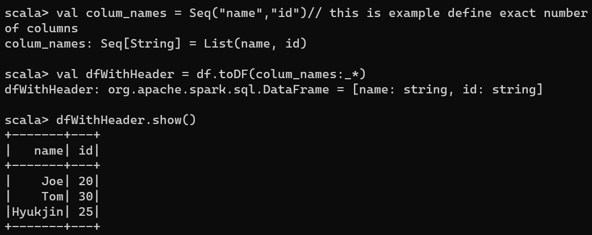

## Older way to read  csv files

During the first versions of spark we can create an SQLContext in Spark shell by passing a default SparkContext object (sc) as a parameter to the SQLContext constructor.

```
val sqlcontext = new org.apache.spark.sql.SQLContext(sc)
```

Since the  2.0 the  SQLContext() constructor has been deprecated and recommend to use sqlContext method from SparkSession for example spark.sqlContext


```
val sqlContext = spark.sqlContext
```


```
val sqlContext = spark.sqlContext
//read csv with options
val df = sqlContext.read.options(Map("inferSchema"->"true","delimiter"->",","header"->"true")).csv(PATH)
df.show()
df.printSchema()
```
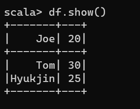

```
df.createOrReplaceTempView("TAB")
sqlContext.sql("select * from TAB").show(false)
```

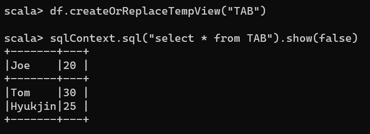

## Empty Dataframe with no schema

Here we will create an empty dataframe with does not have any schema/columns. For this we will use emptyDataframe() method.

 Lets us see an example below.

```
val df: DataFrame =spark.emptyDataFrame
```


## Empty Dataframe with schema

Here we will create an empty dataframe with schema. We will make use of createDataFrame method for creation of dataframe. Just like emptyDataframe here we will make use of emptyRDD[Row] tocreate an empty rdd . We will also create a strytype schema variable. Let us see an example.

```
  val schema = new StructType()
    .add("fnm",StringType,false)
    .add("lnm",StringType,false)
  val df: DataFrame = spark.createDataFrame(spark.sparkContext.emptyRDD[Row],schema)
  df.printSchema()
```


How to determine the class of a Scala object (getClass)


Spark Read ORC file
Use Spark DataFrameReader’s orc() method to read ORC file into DataFrame. This supports reading snappy, zlib or no compression, it is not necessary to specify in compression option while reading a ORC file.

Spark 2.x:

```
spark.read.orc("/tmp/orc/data.orc")
```

In order to read ORC files from Amazon S3, use the below prefix to the path along with third-party dependencies and credentials.

s3:\\ = > First gen
s3n:\\ => second Gen
s3a:\\ => Third gen

Spark 1.6:

```
hiveContext.read.orc('tmp/orc/data.orc')
```


```
if(Boolean_expression) {
   // Statements will execute if the Boolean expression is true
}
```
How to match multiple conditions (patterns) with one case statement
```
val cmd = "stop"
cmd match {
    case "start" | "go" => println("starting")
    case "stop" | "quit" | "exit" => println("stopping")
    case _ => println("doing nothing")
}
```

Scala If-Else-If Ladder Example

```
var number:Int = 85  
if(number>=0 && number<50){  
    println ("fail")  
}  
else if(number>=50 && number<60){  
    println("D Grade")  
}  
else if(number>=60 && number<70){  
    println("C Grade")  
}  
else if(number>=70 && number<80){  
    println("B Grade")  
}  
else if(number>=80 && number<90){  
    println("A Grade")  
}  
else if(number>=90 && number<=100){  
    println("A+ Grade")  
}  
else println ("Invalid")  
```


Merge Multiple Data Frames in Spark

```
      // Approach 1
      val mergeDf = empDf1.union(empDf2).union(empDf3)
      mergeDf.show()

      // Approach 2
      val dfSeq = Seq(empDf1, empDf2, empDf3)
      val mergeSeqDf = dfSeq.reduce(_ union _)
      mergeSeqDf.show()
```

## Creating a Sequence in Scala

First see how to create a sequence in Scala. The following syntax is used to create a list in Scala,

Syntax:

1)  ### Creating an empty sequence,
    
    ```
    var emptySeq: Seq[data_type] = Seq();
    ```
    
    
2)  ### Creating an Sequence with defining the data type,
    
    ```
    var mySeq: Seq[data_type] = Seq(element1, element2, ...)
    ```
    
    
3)  ### Creating an Sequence without defining the data type,
    
    ```
    var mySeq = Seq(element1, element2, ...)
    ```
    
    

## How to initialize a Sequence with 3 elements

```
val seq1: Seq[String] = Seq("Plain Donut","Strawberry Donut","Chocolate Donut")
```

ow to add elements to Sequence using :+

```
val seq2: Seq[String] = seq1 :+ "Vanilla Donut"
```

The code below shows how to initialize an empty Sequence.

```
val emptySeq: Seq[String] = Seq.empty[String]
```

Need	Method
append 1 item	oldSeq :+ e
append multiple items	oldSeq ++ newSeq
prepend 1 item	e +: oldSeq
prepend multiple items	newSeq ++: oldSeq
Remember that Vector and Seq are immutable, so you can’t modify them. Therefore, during the append or prepend operations, you need to assign the result to a new variable.
```
object MyClass {

    def main(args: Array[String])
    {
         val a = Seq("Apple", "Orange", "Mango")

        val temp = a :+ "Watermelon"

         println(temp)
    }
}
```


```
object MyClass {

    def main(args: Array[String])
    {
         val fruits = Seq("Apple", "Orange", "Mango")

         val vegetables = Seq("Onion","tomato","potato")

        val temp = fruits ++ vegetables

         println(temp)
    }
}
```


## How to delete elements from a list in Scala?

```
        var progLang = List("C++", "Java", "Scala", "Python")
        
        println("Programming Languages: " + progLang)
        
        var newLang = progLang.filter(_<"P")
        
        println("Programming Languages: " + newLang)
```

```
import scala.collection.mutable.ListBuffer


var progLang = ListBuffer("C", "C++", "Java", "Scala", "Python", "JavaScript")
        
        println("Programming Languages: " + progLang)
        
        println("Deleting single element")
        progLang -= "Java"
        println("Programming Languages: " + progLang)
        
        println("Deleting multiple elements")
        progLang -= ("C", "Python")
        println("Programming Languages: " + progLang)
```


Converting a Collection to a String with mkString

Use the mkString method to print a collection as a String. Given a simple collection:
```
val a = Array("apple", "banana", "cherry")
```
you can print the collection elements using mkString:
```
a.mkString(", ")
```
res3: String = apple, banana, cherry


Declaring Array Variables
To use an array in a program, you must declare a variable to reference the array and you must specify the type of array the variable can reference.

The following is the syntax for declaring an array variable.
```
var z:Array[String] = new Array[String](3)
```

or
```
var z = new Array[String](3)
```

Here, z is declared as an array of Strings that may hold up to three elements. Values can be assigned to individual elements or get access to individual elements, it can be done by using commands like the following −

```
z(0) = "Zara"; z(1) = "Nuha"; z(4/2) = "Ayan"
```


```
import scala.collection.mutable.ArrayBuffer
val ab = ArrayBuffer[String]()
ab += "hello"
ab += "world"
ab.toArray
```

## Summary of  SparkSession Methods

version – Returns Spark version where your application is running, probably the Spark version your cluster is configured with.
conf – Returns the RuntimeConfig object.
builder() – builder() is used to create a new SparkSession, this return SparkSession.Builder
newSession() – Creaetes a new SparkSession.
createDataFrame() – This creates a DataFrame from a collection and an RDD
createDataset() – This creates a Dataset from the collection, DataFrame, and RDD.
emptyDataFrame() – Creates an empty DataFrame.
emptyDataset() – Creates an empty Dataset.
getActiveSession() – Returns an active Spark session for the current thread.
getDefaultSession() – Returns the default SparkSession that is returned by the builder.
read() – Returns an instance of DataFrameReader class, this is used to read records from CSV, Parquet, Avro, and more file formats into DataFrame.
sparkContext() – Returns a SparkContext.
sql(String sql) – Returns a DataFrame after executing the SQL mentioned.
sqlContext() – Returns SQLContext.
stop() – Stop the current SparkContext.
table() – Returns a DataFrame of a table or view.
udf() – Creates a Spark UDF to use it on DataFrame, Dataset, and SQL.

For addtional information about [hdfs](https://hadoop.apache.org/docs/stable/api/org/apache/hadoop/fs/FileSystem.html)

**Congratulations!** We have practiced some essential thing in Spark.